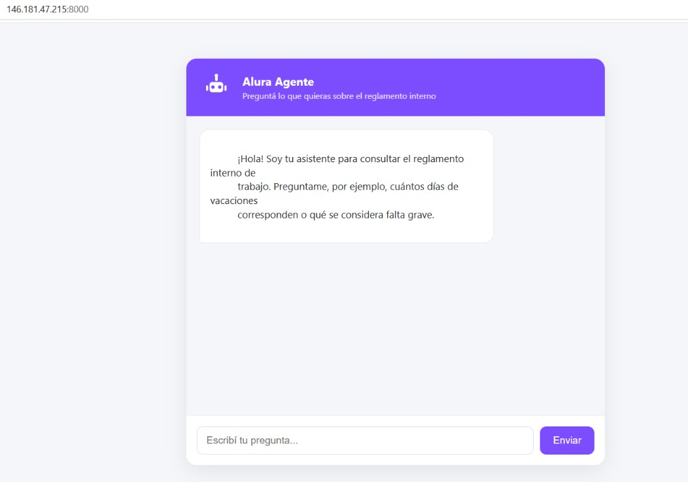
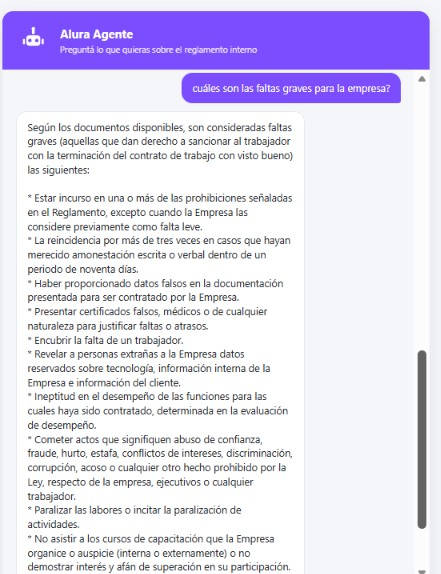
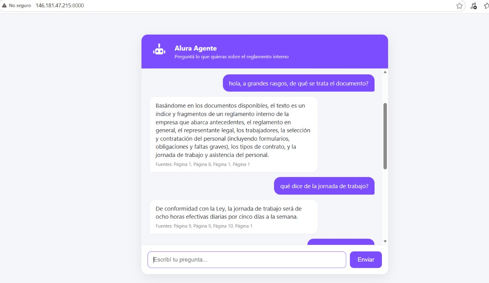

# Alura Agente – Agente de IA para documentos internos

## Descripción general

Este proyecto es un agente de inteligencia artificial que responde preguntas
en lenguaje natural sobre documentos internos de una empresa. Implementa un
sistema RAG (Retrieval-Augmented Generation): en lugar de que el modelo de
lenguaje "adivine" una respuesta, primero busca los fragmentos más relevantes
del documento original y luego genera la respuesta basándose únicamente en
ese contenido, citando de qué página proviene la información.

Como caso de uso se utilizó el *Reglamento Interno de Trabajo* de una
empresa real (Microfinanza Calificadora de Riesgos S.A. – Microriesg,
Ecuador), un documento PDF de 31 páginas con políticas de vacaciones,
licencias, sanciones, jornada laboral, etc. El agente responde preguntas
como "¿cuántos días de vacaciones corresponden?" citando el artículo exacto
del reglamento.

El proyecto está desplegado y accesible públicamente en una instancia de
Oracle Cloud Infrastructure (OCI), con una interfaz web de chat simple
además de la API REST.

## Arquitectura

```
┌─────────────┐     ┌──────────────┐     ┌───────────────────┐
│  docs/*.pdf │ ──▶ │  ingest.py   │ ──▶ │ vectorstore/       │
│ (documento) │     │ (split +     │     │ (índice FAISS)     │
└─────────────┘     │  embeddings) │     └──────────┬─────────┘
                     └──────────────┘                │
                                                      ▼
┌─────────────┐     ┌──────────────┐     ┌───────────────────┐
│  Usuario    │ ──▶ │  app.py      │ ──▶ │  agente.py         │
│ (pregunta)  │     │ (API REST)   │     │ (RetrievalQA +      │
│             │ ◀── │              │ ◀── │  Gemini)            │
└─────────────┘     └──────────────┘     └───────────────────┘
```

**Flujo:**
1. `ingest.py` lee el PDF, lo divide en fragmentos y genera embeddings con
   Gemini (`gemini-embedding-001`), guardando todo en un índice FAISS local.
2. `agente.py` carga ese índice y arma una cadena `RetrievalQA`: ante cada
   pregunta, busca los fragmentos más relevantes y se los pasa al modelo
   `gemini-3.5-flash-lite` junto con un prompt que le indica responder solo con
   base en el contexto recuperado.
3. `app.py` expone el agente como una API REST con FastAPI, lista para
   desplegarse en una instancia de OCI Compute. Además sirve una interfaz web
   simple (`static/`) con un chat y un personaje genérico como agente, para
   probar el asistente desde el navegador sin necesidad de `curl`.

## Tecnologías

- Python 3.10+
- LangChain + langchain-google-genai
- Gemini (embeddings + LLM), vía Google AI Studio
- FAISS (vector store local)
- FastAPI + Uvicorn
- OCI Compute (deploy)

## Instrucciones para ejecutar el proyecto

### 1. Clonar el repositorio e instalar dependencias

```bash
git clone <URL_DEL_REPO>
cd alura-agente
python -m venv venv
source venv/bin/activate   # En Windows: venv\Scripts\activate
pip install -r requirements.txt
```

### 2. Configurar la API key de Gemini

Obtené una API key gratuita en https://aistudio.google.com/app/apikey

```bash
cp .env.example .env
# Editar .env y pegar tu GOOGLE_API_KEY
```

### 3. Procesar el documento (Etapa 1)

Colocá tu PDF dentro de `docs/` y corré:

```bash
python ingest.py docs/tu_documento.pdf
```

### 4. Probar el agente por consola (Etapa 2)

```bash
python agente.py
```

### 5. Levantar la API localmente

```bash
uvicorn app:app --host 0.0.0.0 --port 8000
```

Probar con:

```bash
curl -X POST http://localhost:8000/preguntar \
     -H "Content-Type: application/json" \
     -d '{"pregunta": "¿Cuál es la política de vacaciones?"}'
```

## Ejemplos de preguntas y respuestas

Documento usado: *Reglamento Interno de Trabajo* de Microfinanza Calificadora
de Riesgos S.A. (Microriesg), Ecuador.

**Preguntas que el agente puede responder:**
- ¿Cuántos días de vacaciones tienen los trabajadores al año?
- ¿Cuál es la jornada de trabajo?
- ¿Está permitido fumar dentro de la empresa?
- ¿Qué pasa si un trabajador falta más de 3 días sin justificación?
- ¿Cuál es el tope de las multas que puede aplicar la empresa?
- ¿Qué se considera falta grave?

**Respuestas reales generadas por el agente:**

| Pregunta | Respuesta del agente |
|---|---|
| ¿Cuántos días de vacaciones tienen los trabajadores al año? | 15 días ininterrumpidos, incluidos los días no laborables (Art. 20). |
| ¿Cuál es la jornada de trabajo? | 8 horas efectivas diarias, 5 días a la semana (Art. 14). |
| ¿Está permitido fumar dentro de la empresa? | No, está expresamente prohibido (Art. 36, literal t). |
| ¿Qué pasa si un trabajador falta más de 3 días sin justificación? | La Empresa puede terminar la relación laboral mediante visto bueno (Art. 14). |
| ¿Cuál es el tope de las multas que puede aplicar la empresa? | No puede exceder el 10% de la remuneración (Art. 24 y Art. 42). |

## Deploy en OCI

🔗 **Aplicación funcionando:** http://146.181.47.215:8000



Pasos seguidos para el deploy:
1. Se creó una instancia gratuita (Always Free) en OCI Compute con Ubuntu 24.04.
2. Se abrió el puerto 8000 tanto en la Security List de la VCN como en el
   firewall interno (`iptables`) de la instancia.
3. Se clonó el repositorio, se creó el entorno virtual, se instalaron las
   dependencias y se configuró el `.env` con la API key de Gemini.
4. Se generó el índice vectorial corriendo `ingest.py` directamente en la
   instancia.
5. Se dejó la API corriendo de forma permanente con **systemd**
   (`alura-agente.service`), de modo que sobrevive a reinicios de la
   instancia y a cierres de sesión SSH:

   ```ini
   [Unit]
   Description=Alura Agente - API del agente RAG
   After=network.target

   [Service]
   User=ubuntu
   WorkingDirectory=/home/ubuntu/alura-agente
   Environment="PATH=/home/ubuntu/alura-agente/venv/bin"
   ExecStart=/home/ubuntu/alura-agente/venv/bin/uvicorn app:app --host 0.0.0.0 --port 8000
   Restart=always
   RestartSec=5

   [Install]
   WantedBy=multi-user.target
   ```

6. Se accede a la aplicación desde `http://<IP_PUBLICA_INSTANCIA>:8000`.

**Conversaciones reales con el agente desplegado:**





## Estructura del repositorio

```
alura-agente/
├── docs/                # PDFs a procesar
├── vectorstore/          # Índice FAISS generado (no versionado)
├── static/                # Interfaz web (HTML/CSS/JS) servida por app.py
├── ingest.py             # Etapa 1: procesamiento del documento
├── agente.py              # Etapa 2: agente RAG
├── app.py                 # Etapa 3: API REST + interfaz web para el deploy
├── requirements.txt
├── .env.example
└── README.md
```
